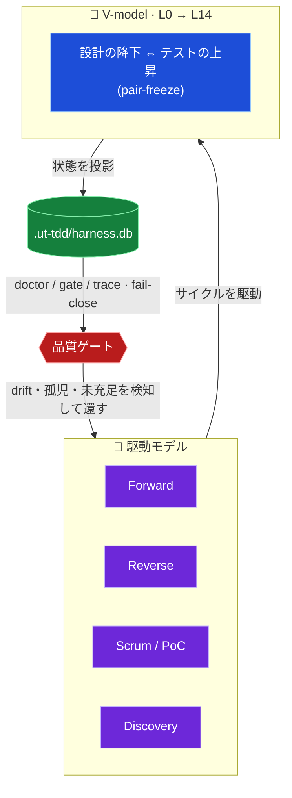
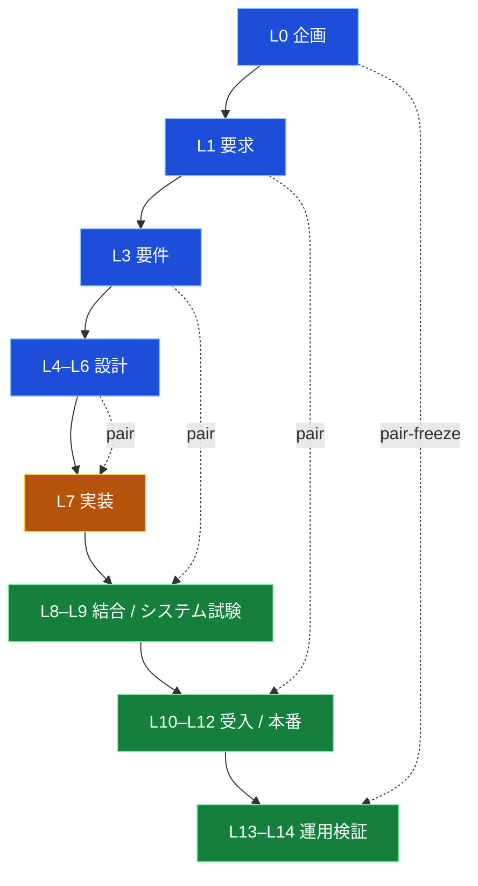
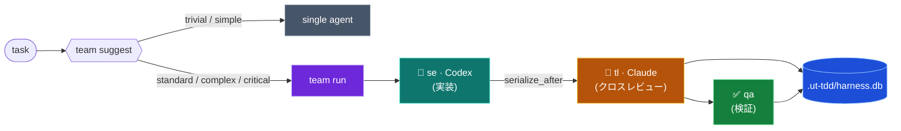

<div align="center">

# 🧭 UT-TDD Agent Harness

### AI 実装エージェントを、チーム開発で _安全に_ 使うための検証・開発基盤

**V-model** × **駆動モデル** が **`harness.db`** を通じてサイクルを回し、品質を機械で守ります。
provider の API キーは、リポジトリに置きません。

<br>


-orange?style=flat-square)

<sub><b>しばくべし</b> · <b>コンセプト</b> · <b>V-model</b> · <b>駆動モデル</b> · <b>クイックスタート</b> · <b>コマンド早見表</b> · <b>検証</b></sub>

</div>

---

## 🔥 なぜ作ったのか

AI エージェントは、**とりあえず動くものを作ろうとします**。

しかも、出来上がったコードをこちらが隅々まで読んでいるわけではありません。
そのため後になって「これは…」と気づく問題が、どうしても出てきます。

テストと証跡で締め上げ、「完了しました」を二度と鵜呑みにしない ── そうした仕組みが欲しかったのです。
そうして生まれたのが、**UT-TDD Agent Harness** です。

> [!NOTE]
> ひとことで言えば、**AI の「完了しました」をテストと機械チェックで検証し直すための基盤** です。
> V-model / TDD ガバナンス・`doctor`・ハンドオーバー・provider アダプタ・Claude / Codex のチーム委譲を、**API キーをリポジトリに置かず**ローカルの TypeScript / Bun で回します。
> そしてこれは完成品ではなく、**「土台」** です ── その上で動くプロダクト開発を、安全にするための地面にあたります。

## 🧱 6 本の柱

| | 柱 | 内容 |
|:--:|---|---|
| 1 | **Foundation first** | ハーネスは下流のプロダクト開発を安全にする土台 |
| 2 | **Document-first + 機械強制** | ワークフロー規約は schema / lint / doctor / hook / test で裏打ち |
| 3 | **自動の状態とフィードバック** | `.ut-tdd/` 状態と `harness.db` 投影で進捗・gap・drift を可視化 |
| 4 | **動的コンテキスト / スキル注入** | 関連するコンテキストとスキルだけをロード |
| 5 | **実用本位のオーケストレーション** | リスク・コストを下げる所だけ役割 / runtime を分割 |
| 6 | **厳格な検証** | テストか明示証跡なしに「完了」を宣言しない |

## 🥊 しばくべし AI の○○行動

AI には、ありがちな悪癖があります。その一つひとつを、対応する機能で迎え撃ちます。

| しばくべき AI の○○行動 | よくある症状 | しばく機能 |
|---|---|---|
| 🤖 **完了詐称行動** | 「完了しました!」と言うが、証跡は無い | `ut-tdd doctor` / 厳格検証 ── テスト・証跡なしに完了を通さない |
| 🏃 **見切り発車行動** | 考えるより先に手が動き、とりあえず作る | `ut-tdd task classify` → `team suggest` ── 着手前に難易度と編成を判定 |
| 🧟 **書き逃げ行動** | 実装だけ済ませ、設計ドキュメントを残さない | **Reverse 駆動** `R0 → R4` で設計・要件を back-fill |
| 🪓 **越境行動** | スコープ外を触り、他人の編集を壊す | `serialize_after` + agent-guard +「他人の編集を revert しない」 |
| 🪞 **自画自賛行動** | 自分の実装を、自分でレビューして合格させる | **hybrid クロスレビュー** ── worker ≠ reviewer を別 provider に |
| 💸 **富豪行動** | 何でも最上位モデルでぶん回す | 決定論的モデル選択 ── 難易度から model / effort を自動決定 |
| 🧠 **健忘行動** | 文脈を忘れ、引き継ぎが雑になる | `ut-tdd handover` ── 機械 + 明示の 2 系統で残す |
| 🔑 **鍵ばらまき行動** | API キーやシークレットを平気でコードに書く | 鍵を持たない設計 ── provider 認証は公式 CLI 側、リポジトリに置かない |
| 📊 **見せかけ行動** | カウントは緑、でも中身が伴っていない | 「被覆 ≠ 中身」+ `harness.db` 投影 + doctor の fail-close |

## 🧬 コンセプト — 品質を守るサイクル

このハーネスの核心は、**V-model** と **駆動モデル** が **`harness.db`** を通じてサイクルを回し、品質を機械的に守ることです。



> [!IMPORTANT]
> **宣言ではなく機械で守る。** 「被覆(ID 登録)」と「中身(descent)」を分け、未充足・孤児・drift を `doctor` が **fail-close** で止めます。カウントが通っても中身が無ければ通しません。

## 📐 V-model(L0 → L14)

設計の降下(左腕)とテストの上昇(右腕)が **pair-freeze** で1対1に対応します。



## 🚗 駆動モデル

タスクの性質に応じて、**招集する専門職とサイクル**を切り替えます。

| 駆動 | サイクル | 使いどころ |
|---|---|---|
| **Forward** | `plan → pair-freeze → implement → trace-freeze → review → accept` | 通常の前進開発 |
| **Reverse** | `R0 → R1 → R2 → R3 → R4 → Forward merge` | 既存実装から設計/要件を back-fill |
| **Scrum / PoC** | `S0 backlog → S1 plan → S2 poc → S3 verify → S4 decide` | 不確実性の検証・意思決定 |
| **Discovery** | 必須 + 駆動モデル合成 → exit | メタ的な workflow 探索・triage |
| **Recovery / Troubleshoot** | 復旧 → 認識合わせ → 上流から修正 → fullback | 暴走・強制停止・前提崩れからの立て直し |

## 🔁 タスクの流れ(チーム委譲)



worker と reviewer を**別 provider**(Codex ↔ Claude)に割り当てることで、同一モデルによる自己承認を防ぎます。

## 🚀 クイックスタート

```powershell
bun install

# ハーネス状態を受け取りたい既存プロジェクトのディレクトリで
powershell -NoProfile -ExecutionPolicy Bypass -File C:\path\to\UT-TDD-agent-harness\scripts\ut-tdd.ps1 setup --solo
bun .ut-tdd\bin\ut-tdd.mjs doctor --setup-smoke
```

生成される Claude/Codex hook は `bun .ut-tdd/bin/ut-tdd.mjs ...` を呼びます。
この wrapper は `ut-tdd setup` によって各 consumer リポジトリへ投影され、
対象リポジトリの `node_modules/.bin/ut-tdd`、setup を実行した harness checkout、
global `ut-tdd` の順に解決します。これにより、1 台の PC に複数プロジェクトが
同居しても global harness version の取り合いにならず、clone した harness checkout
から consumer repo を bootstrap できます。setup 済みと判定する前に、Claude/Codex hook
が実際に動く shell で次を確認してください:

```powershell
bun .ut-tdd\bin\ut-tdd.mjs --help
```

Windows では、hook shell から Bun 本体も解決できる必要があります。npm shim 経由で
Bun を入れている場合は、setup 済みと判定する前に実 Bun binary directory を PATH に
追加して確認します。Windows の npm-installed Bun では次の形です:

```powershell
$env:PATH="$env:APPDATA\npm\node_modules\bun\bin;$env:PATH"
bun .ut-tdd\bin\ut-tdd.mjs --help
```

## ⚙️ セットアップ

| シーン | コマンド |
|---|---|
| 確認のみ(書き込まない) | `ut-tdd setup --dry-run` |
| ソロ開発 | `ut-tdd setup --solo` |
| チーム開発 | `ut-tdd setup --team --tl-team @org/tl --qa-team @org/qa --po-team @org/po` |
| ブランチ保護まで適用 | `ut-tdd setup --team … --apply-branch-protection` |

> `--tl-team` / `--qa-team` / `--po-team` は 3 つセットで指定(CODEOWNERS の `@TODO` 混入防止)。`.ut-tdd/state/setup.json` と GitHub workflow / テンプレートを生成し、ブランチ保護は既定で emit-only。

## 🗺️ コマンド早見表

| コマンド | 用途 |
|---|---|
| `ut-tdd setup --solo` / `--team` | 対象リポジトリの初期化(ソロ / チーム) |
| `ut-tdd status` | 実行モード検出(`standalone` / `claude-only` / `codex-only` / `hybrid`) |
| `ut-tdd doctor --setup-smoke` | setup 投影物と hook wrapper の最小検証 |
| `ut-tdd doctor` | 設計/PLAN を持つ対象リポジトリのガバナンス一括検証(gate / trace / drift / roadmap) |
| `ut-tdd db rebuild --json` | `harness.db` の再投影 |
| `ut-tdd plan lint` | PLAN の schema / 依存検証 |
| `ut-tdd vmodel lint` | V-model trace(設計 ⇔ テストの pair)の検証 |
| `ut-tdd review --uncommitted` | 未コミット変更のレビューパケット生成 |
| `ut-tdd task classify --text "…"` | タスク難易度の分類 |
| `ut-tdd skill suggest --plan <path>` | PLAN に対するスキル提案 |
| `ut-tdd team suggest --task "…"` | チーム起動要否の判定 |
| `ut-tdd team run --definition <yaml>` | チーム launch plan の構築 / 実行 |
| `ut-tdd codex --role <role> --task "…"` / `ut-tdd claude …` | provider 委譲(worker / reviewer)。`--execute` で実 CLI 起動、既定は dry-run |
| `ut-tdd route eval --signal <signal>` | signal を mode / 推奨コマンドへ routing |
| `ut-tdd handover` | ハンドオーバー(機械 + 明示)の生成 |
| `ut-tdd feedback list` / `pending` | `harness.db` の引き継ぎ feedback / Recovery 起票候補を surface |
| `ut-tdd graph impact` / `export` | クロス成果物リレーショングラフの影響分析 / 図出力(mermaid / dot) |
| `ut-tdd verify recommend` / `run --profile <id>` | 変更ファイルからの検証プロファイル推奨 / 実行(`mcp profile list` で一覧) |
| `ut-tdd telemetry scan --json` | コストテレメトリの走査 |
| `ut-tdd distribution plan` | clean 配布の export / preflight / rollback 計画(実カットは PO 承認が必要) |
| `ut-tdd distribution package --out .ut-tdd/release` | clean 配布 tarball / sha256 / manifest をローカル生成(署名・公開は外部承認が必要) |

<details>
<summary><b>📦 対象リポジトリへの導入(詳細)</b></summary>

<br>

現在の配布形態は、公開パッケージではなく、ソースチェックアウト / git 依存です。このハーネスのチェックアウトから:

```powershell
bun install
```

次に、ハーネス状態を受け取りたい既存プロジェクトのディレクトリで setup を実行します:

```powershell
powershell -NoProfile -ExecutionPolicy Bypass -File C:\path\to\UT-TDD-agent-harness\scripts\ut-tdd.ps1 setup --dry-run
powershell -NoProfile -ExecutionPolicy Bypass -File C:\path\to\UT-TDD-agent-harness\scripts\ut-tdd.ps1 setup --solo
```

チームリポジトリの場合:

```powershell
powershell -NoProfile -ExecutionPolicy Bypass -File C:\path\to\UT-TDD-agent-harness\scripts\ut-tdd.ps1 setup --team --tl-team @org/tl --qa-team @org/qa --po-team @org/po
```

POSIX シェルでも同じ「カレントディレクトリ」ルールを使います:

```sh
/path/to/UT-TDD-agent-harness/scripts/ut-tdd setup --dry-run
/path/to/UT-TDD-agent-harness/scripts/ut-tdd setup --solo
```

`setup` は GitHub の workflow/テンプレートと `.ut-tdd/state/setup.json` を書き出します。ブランチ保護はデフォルトでは emit のみ(出力するだけ)で、適用には明示的な人間 / 管理者の手順が必要です:

```powershell
scripts/setup-branch-protection.sh
```

setup の経路には組み込みテンプレートがあるため、対象プロジェクトにこのリポジトリの `docs/templates/github` ツリーが存在する前でも実行できます。
setup 直後の導通確認は `bun .ut-tdd\bin\ut-tdd.mjs doctor --setup-smoke` を使います。
full `doctor` は、対象リポジトリに UT-TDD の設計 doc / PLAN / test-design が降下した後の
ガバナンス検証です。ハーネス Pack そのものや、まだ設計文書を持たない consumer repo の
初期導入判定には使いません。

</details>

<details>
<summary><b>⌨️ 日常コマンド</b></summary>

<br>

```powershell
powershell -NoProfile -ExecutionPolicy Bypass -File .\scripts\ut-tdd.ps1 doctor
powershell -NoProfile -ExecutionPolicy Bypass -File .\scripts\ut-tdd.ps1 db rebuild --json
powershell -NoProfile -ExecutionPolicy Bypass -File .\scripts\ut-tdd.ps1 telemetry scan --json
powershell -NoProfile -ExecutionPolicy Bypass -File .\scripts\ut-tdd.ps1 team suggest --task "production security schema migration" --mode hybrid --json
powershell -NoProfile -ExecutionPolicy Bypass -File .\scripts\ut-tdd.ps1 team run --definition .ut-tdd\teams\team.yaml --mode hybrid --json
```

`--execute` は、provider CLI を実際に起動すべきときだけ使います:

```powershell
powershell -NoProfile -ExecutionPolicy Bypass -File .\scripts\ut-tdd.ps1 team run --definition .ut-tdd\teams\team.yaml --mode hybrid --execute
```

</details>

<details>
<summary><b>🧩 チーム定義</b></summary>

<br>

```yaml
name: speed-team
strategy: parallel
max_parallel: 2
members:
  - role: se
    engine: codex-se
    task: implement the adapter change
  - role: tl
    engine: pmo-sonnet
    task: review the adapter change
    serialize_after: se
```

任意のメンバーフィールド:

- `difficulty`: `trivial`、`simple`、`standard`、`complex`、`critical` のいずれか
- `model`: 明示的な model 上書き。受け付ける値は provider の ID / ファミリ: `gpt-*`、`claude-*`、`codex-*`、`haiku`、`sonnet`、`opus`、`local`
- `effort`: `low`、`medium`、`high` のいずれか

省略した場合、ハーネスはタスクテキストから難易度を推論し、launch plan に `model_selection` を記録します。`serialize_after` は依存制御で、ランナーは依存先を先に並べ、依存先が失敗したら依存元をスキップします。

</details>

<details>
<summary><b>🤖 サブエージェントを起動するタイミング</b></summary>

<br>

タスクの出所が自由記述テキストのときは、`team run` の前に `team suggest` を使います:

```powershell
powershell -NoProfile -ExecutionPolicy Bypass -File .\scripts\ut-tdd.ps1 team suggest --task "subagent runtime adapter refactor" --json
```

ポリシーは決定論的です:

- `trivial` と `simple` のタスクは、リスク用語を含まない限りシングルエージェントのままです。
- `standard`・`complex`・`critical` のタスクは、`hybrid` モードでクロス provider チームを推奨します。
- `auth`、`database`、`doctor`、`migration`、`production`、`runtime`、`schema`、`security`、`subagent`、`windows` などのリスク用語は、`hybrid` モードでチーム推奨を強制します。
- `hybrid` 以外のモードでは `should_launch=false` と `trigger="unavailable"` を返します。ハーネスはクロス provider レビューを黙って偽装しません。
- `complex` と `critical` の推奨では、レビュアー作業を実装の後ろに直列化します。`critical` ではさらに QA 検証者を追加します。

返される `definition` は `.ut-tdd/teams/<name>.yaml` として保存するか、`team run` が使うのと同じスキーマに渡せます。

</details>

<details>
<summary><b>🔐 Provider 境界</b></summary>

<br>

通常の入口は `ut-tdd codex` / `ut-tdd claude`(`--role` 委譲ラッパ)です。raw な `codex exec` / `claude --print` を直接の常用経路にはしません。以下は、そのラッパが内部で起動する provider CLI の形です。

model が選択されている場合、Codex は `codex exec <task> -m <model>` として起動します。Claude は `claude --print --model <model> --effort <low|medium|high> -p <prompt>` として起動し、同じ effort 値を `CLAUDE_CODE_EFFORT_LEVEL` でも受け取ります。Codex の reasoning effort は決定論的に選択され、対応する Codex CLI の effort フラグが確定するまでは証跡 / プロンプトのメタデータに記録されます。

managed なアダプタ呼び出しでは、ハーネスは legacy の raw-provider ガード環境マーカーを provider 実行前に**剥がし、それらを渡しません**。provider の認証情報は各公式 CLI のログインが保持し続けます。

</details>

## ✅ 検証

```powershell
bun run typecheck
bun run lint
bun run test:fast
bun run test:db
bun run test:cli
bun run test
bun run test:node-fallback
powershell -NoProfile -ExecutionPolicy Bypass -File .\scripts\ut-tdd.ps1 doctor
```

> [!TIP]
> plan やドキュメントの変更後に `.ut-tdd/harness.db` が古くなっている場合、`doctor` は失敗する想定です。
> `bun src/cli.ts db rebuild --json` で投影を再構築してから `doctor` を再実行してください。

<div align="center">
<br>
<sub><b>UT-TDD Agent Harness</b> — TypeScript core · ADR-001<br>土台が、その上で動くプロダクト開発を安全にします。</sub>
</div>
