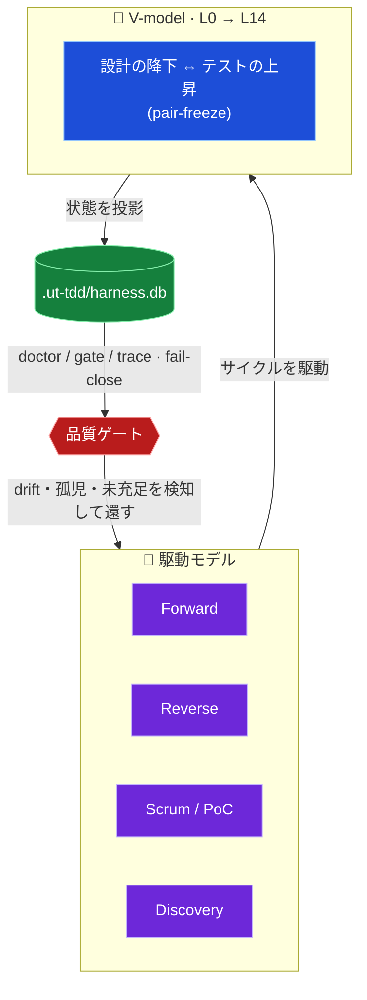
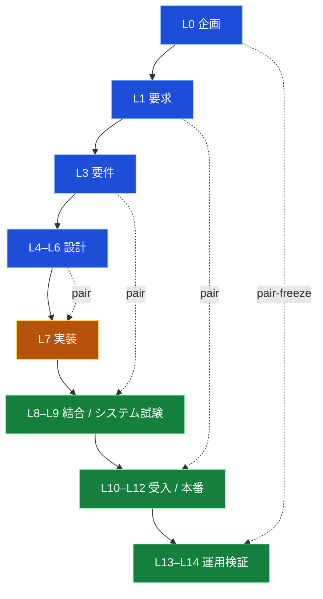

<div align="center">

# 🧭 UT-TDD Agent Harness

### AI 実装エージェントを、チーム開発で安全に走らせるための検証・開発基盤

**V-model** × **駆動モデル** × **`harness.db`** で、AI の作業を設計・実装・検証のサイクルへ閉じ込めます。
provider の API キーはリポジトリへ置かず、ローカル CLI と機械 gate で運用します。

<br>


<sub><b>しばくべし</b> · <b>コンセプト</b> · <b>V-model</b> · <b>駆動モデル</b> · <b>クイックスタート</b> · <b>コマンド早見表</b> · <b>検証</b></sub>

</div>

---

## 🔥 なぜ作ったのか

AI エージェントは速いです。速いぶん、**「とりあえず動く」へ一直線に走ります**。

人間がすべての差分を隅々まで読み切れるなら、それでも構いません。
でも実際には、後から「ここ、誰が保証したんだっけ」となる瞬間が出てきます。

そこで、AI の「完了しました」をテスト・証跡・機械 gate で受け止め直す土台を作りました。
それが **UT-TDD Agent Harness** です。

> [!NOTE]
> ひとことで言えば、**AI の「完了しました」を、テストと機械チェックで検証し直す基盤**です。
> V-model / TDD ガバナンス、`doctor`、ハンドオーバー、provider アダプタ、Claude / Codex のチーム委譲を、ローカルの TypeScript / Bun で回します。
> これは完成品アプリではなく、**プロダクト開発を安全にするための土台**です。

## 🧱 6 本の柱

| | 柱 | 内容 |
|:--:|---|---|
| 1 | **Foundation first** | 下流のプロダクト開発を安全にする土台を先に固める |
| 2 | **Document-first + 機械強制** | ワークフロー規約を schema / lint / doctor / hook / test で裏打ちする |
| 3 | **自動の状態とフィードバック** | `.ut-tdd/` と `harness.db` で進捗・gap・drift を見える化する |
| 4 | **動的コンテキスト / スキル注入** | 必要なコンテキストとスキルだけを、必要なタイミングで渡す |
| 5 | **実用本位のオーケストレーション** | リスク・コストが下がる場面だけ、役割と runtime を分ける |
| 6 | **厳格な検証** | テストか明示証跡なしに「完了」を通さない |

## 🥊 しばくべし AI の○○行動

AI には、ありがちな悪癖があります。UT-TDD Agent Harness は、それを人間の根性ではなく機械のルールで受け止めます。

| しばくべき AI の○○行動 | よくある症状 | しばく機能 |
|---|---|---|
| 🤖 **完了詐称行動** | 「完了しました!」と言うが、証跡は無い | `ut-tdd doctor` / 厳格検証: テスト・証跡なしに完了を通さない |
| 🏃 **見切り発車行動** | 考えるより先に手が動き、とりあえず作る | `ut-tdd task classify` → `team suggest`: 着手前に難易度と編成を判定 |
| 🧟 **書き逃げ行動** | 実装だけ済ませ、設計ドキュメントを残さない | **Reverse 駆動** `R0 → R4` で設計・要件を back-fill |
| 🪓 **越境行動** | スコープ外を触り、他人の編集を壊す | `serialize_after` + agent-guard +「他人の編集を revert しない」 |
| 🪞 **自画自賛行動** | 自分の実装を、自分でレビューして合格させる | **hybrid クロスレビュー**: worker ≠ reviewer を別 provider に分離 |
| 💸 **富豪行動** | 何でも最上位モデルでぶん回す | 決定論的モデル選択: 難易度から model / effort を自動決定 |
| 🧠 **健忘行動** | 文脈を忘れ、引き継ぎが雑になる | `ut-tdd handover`: 機械 + 明示の 2 系統で残す |
| 🔑 **鍵ばらまき行動** | API キーやシークレットを平気でコードに書く | 鍵を持たない設計: provider 認証は公式 CLI 側に置く |
| 📊 **見せかけ行動** | カウントは緑、でも中身が伴っていない | 「被覆 ≠ 中身」+ `harness.db` 投影 + doctor の fail-close |

## 🧬 コンセプト — 品質を守るサイクル

このハーネスの核心は、**V-model** と **駆動モデル** を **`harness.db`** へ投影し、品質を機械的に守ることです。



> [!IMPORTANT]
> **宣言ではなく機械で守る。** 「被覆(ID 登録)」と「中身(descent)」を分け、未充足・孤児・drift を `doctor` が **fail-close** で止めます。カウントだけが緑でも、中身が無ければ通しません。

## 📐 V-model(L0 → L14)

設計の降下(左腕)とテストの上昇(右腕)が **pair-freeze** で1対1に対応します。



## 🚗 駆動モデル

タスクの性質に応じて、**招集する専門職とサイクル**を切り替えます。通常開発、既存実装からの逆流、PoC、復旧を同じ土台で扱います。

| 駆動 | サイクル | 使いどころ |
|---|---|---|
| **Forward** | `plan → pair-freeze → implement → trace-freeze → review → accept` | 通常の前進開発 |
| **Reverse** | `R0 → R1 → R2 → R3 → R4 → Forward merge` | 既存実装から設計/要件を back-fill |
| **Scrum / PoC** | `S0 backlog → S1 plan → S2 poc → S3 verify → S4 decide` | 不確実性の検証・意思決定 |
| **Discovery** | 必須 + 駆動モデル合成 → exit | メタ的な workflow 探索・triage |
| **Recovery / Troubleshoot** | 復旧 → 認識合わせ → 上流から修正 → fullback | 暴走・強制停止・前提崩れからの立て直し |

## 🔁 タスクの流れ(チーム委譲)


worker と reviewer を**別 provider**(Codex ↔ Claude)に割り当て、同一モデルによる自己承認を防ぎます。

## 🚀 クイックスタート

> [!TIP]
> **導入 → 動作確認 → バージョン更新の完全手順は [セットアップガイド](docs/reference/setup-guide.md) にあります**
> (前提条件 / 既存プロジェクトへの投影 / 動作確認チェックリスト / トラブルシューティング込み)。

最短経路 (Pack を clone してそのまま開発基盤にする):

```sh
git clone https://github.com/unison-ai-product/UT-TDD_AGENT-HARNESS-Pack.git
cd UT-TDD_AGENT-HARNESS-Pack
bun install --frozen-lockfile
bun src/cli.ts setup --solo
bun .ut-tdd/bin/ut-tdd.mjs doctor --setup-smoke   # 期待値: OK (checked=22, failed=0)
```

生成される Claude/Codex hook は `bun .ut-tdd/bin/ut-tdd.mjs ...` を呼びます。
この wrapper は `ut-tdd setup` によって各 consumer リポジトリへ投影され、
対象リポジトリの `node_modules/.bin/ut-tdd`、リポジトリ直下のハーネス source
(`src/cli.ts`、CI runner でも有効)、setup を実行した Pack checkout、global `ut-tdd`
の順に解決します。これにより、1 台の PC に複数プロジェクトが同居しても global
harness version の取り合いにならず、clone した Pack checkout から consumer repo を
bootstrap できます。setup 済みと判定する前に、Claude/Codex hook
が実際に動く shell で次を確認してください:

```sh
bun .ut-tdd/bin/ut-tdd.mjs --help
```

Windows では `scripts/ut-tdd.ps1` も同じ thin wrapper として使えます。hook shell から Bun 本体も解決できる必要があるため、npm shim 経由で Bun を入れている場合は、setup 済みと判定する前に実 Bun binary directory を PATH に追加して確認します:

```powershell
$env:PATH="$env:APPDATA\npm\node_modules\bun\bin;$env:PATH"
bun .ut-tdd\bin\ut-tdd.mjs --help
```

## ⚙️ セットアップ

| シーン | コマンド |
|---|---|
| 確認のみ(書き込まない) | `ut-tdd setup --dry-run` |
| ソロ開発 | `ut-tdd setup --solo` |
| チーム開発 | `ut-tdd setup --team --tl-team @org/tl --qa-team @org/qa --po-team @org/po` |
| ブランチ保護まで適用 | `ut-tdd setup --team … --apply-branch-protection` |

> `--tl-team` / `--qa-team` / `--po-team` は 3 つセットで指定(CODEOWNERS の `@TODO` 混入防止)。`.ut-tdd/state/setup.json` と GitHub workflow / テンプレートを生成し、ブランチ保護は既定で emit-only。

## 🔄 バージョン更新

Pack はタグ付き release (`v0.1.x`) で更新されます。変更点は [CHANGELOG.md](./CHANGELOG.md)、
成果物 (tarball + sha256 + manifest) は [Releases](https://github.com/unison-ai-product/UT-TDD_AGENT-HARNESS-Pack/releases) を参照してください。

```sh
git fetch --tags
git checkout v0.1.4          # 追従運用なら: git pull origin main
bun install --frozen-lockfile
bun src/cli.ts setup --solo  # 冪等再実行 (既存ファイルは保護、managed block のみ更新)
bun .ut-tdd/bin/ut-tdd.mjs doctor --setup-smoke
```

setup の再実行は**非破壊**です: あなたが所有するファイルは上書きされず (対話シェルでは
ファイルごとに `[y/N]` 確認・既定 N、非対話シェルでは常に既存保護)、adapter doc は
managed block 内のみ更新、`.ut-tdd/` runtime 状態は wipe されません。詳細は
[セットアップガイド §4](docs/reference/setup-guide.md)。

## 🗺️ コマンド早見表

| コマンド | 用途 |
|---|---|
| `ut-tdd setup --solo` / `--team` | 対象リポジトリの初期化(ソロ / チーム) |
| `ut-tdd status` | 実行モード検出(`standalone` / `claude-only` / `codex-only` / `hybrid`) |
| `ut-tdd doctor --setup-smoke` | setup 投影物と hook wrapper の最小検証 |
| `ut-tdd doctor` | 設計/PLAN を持つ対象リポジトリのガバナンス一括検証(gate / trace / drift / roadmap) |
| `ut-tdd db rebuild --json` | `harness.db` の再投影 |
| `ut-tdd plan lint` | PLAN の schema / 依存検証 |
| `ut-tdd vmodel lint` | V-model trace(設計 ⇔ テストの pair)の検証 |
| `ut-tdd review --uncommitted` | 未コミット変更のレビューパケット生成 |
| `ut-tdd task classify --text "…"` | タスク難易度の分類 |
| `ut-tdd skill suggest --plan <PLAN id>` | PLAN に対するスキル提案 (`--text "…"` で自由記述からも可) |
| `ut-tdd team suggest --task "…"` | チーム起動要否の判定 |
| `ut-tdd team run --definition <yaml>` | チーム launch plan の構築 / 実行 |
| `ut-tdd codex --role <role> --task "…"` / `ut-tdd claude …` | provider 委譲(worker / reviewer)。`--execute` で実 CLI 起動、既定は dry-run |
| `ut-tdd route eval --signal <signal>` | signal を mode / 推奨コマンドへ routing |
| `ut-tdd handover` | ハンドオーバー(機械 + 明示)の生成 |
| `ut-tdd feedback list` / `pending` | `harness.db` の引き継ぎ feedback / Recovery 起票候補を surface |
| `ut-tdd graph impact` / `export` | クロス成果物リレーショングラフの影響分析 / 図出力(mermaid / dot) |
| `ut-tdd verify recommend` / `run --profile <id>` | 変更ファイルからの検証プロファイル推奨 / 実行(`mcp profile list` で一覧) |
| `ut-tdd telemetry scan --json` | コストテレメトリの走査 |
| `ut-tdd distribution plan` | clean 配布の export / preflight / rollback 計画(実カットは PO 承認が必要) |
| `ut-tdd distribution sync-stage --out <dir>` | clean Pack artifact set をローカル staging directory に materialize し、配布対象外ファイルを検出 |
| `ut-tdd distribution sync-pack --repo-dir <Pack checkout>` | 既存 Pack checkout へ clean artifact set だけを同期(余剰ファイルは `--prune-local` 明示時のみ削除) |
| `ut-tdd distribution package --out .ut-tdd/release` | clean 配布 tarball / sha256 / manifest をローカル生成(署名・公開は外部承認が必要) |

Pack 反映は source 開発 repo から直接 push しません。`sync-pack` は Pack checkout へファイルをコピーし、`git status` / `commit` / `push` の次コマンドを表示するだけです。`docs/plans`、`docs/design`、`docs/test-design`、`.ut-tdd`、dogfood 監査 doc、runtime DB、開発 UI は Pack artifact に入りません。`docs/skills/*` は Pack では root `skills/*` に写像されます。

<details>
<summary><b>📦 対象リポジトリへの導入(詳細)</b></summary>

<br>

現在の配布形態は、公開パッケージではなく、Pack checkout / git 依存です。このハーネスを PATH に入れている場合は `ut-tdd` をそのまま使います。PATH に入れていない場合だけ、Pack checkout の wrapper (`<pack-checkout>/scripts/ut-tdd`) から実行します。Pack checkout では:

```sh
bun install
```

次に、ハーネス状態を受け取りたい既存プロジェクトのディレクトリで setup を実行します:

```sh
ut-tdd setup --dry-run
ut-tdd setup --solo
```

チームリポジトリの場合:

```sh
ut-tdd setup --team --tl-team @org/tl --qa-team @org/qa --po-team @org/po
```

PATH に入れていない Pack checkout から直接実行する場合:

```sh
<pack-checkout>/scripts/ut-tdd setup --solo
```

Windows では同じ操作を PowerShell wrapper で実行できます:

```powershell
C:\path\to\UT-TDD_AGENT-HARNESS-Pack\scripts\ut-tdd.ps1 setup --solo
```

`setup` は GitHub の workflow/テンプレートと `.ut-tdd/state/setup.json` を書き出します。ブランチ保護はデフォルトでは emit のみ(出力するだけ)で、適用には明示的な人間 / 管理者の手順が必要です:

```sh
scripts/setup-branch-protection.sh
```

setup の経路には組み込みテンプレートがあるため、対象プロジェクトにこのリポジトリの `docs/templates/github` ツリーが存在する前でも実行できます。
setup 直後の導通確認は `bun .ut-tdd/bin/ut-tdd.mjs doctor --setup-smoke` を使います。
full `doctor` は、対象リポジトリに UT-TDD の設計 doc / PLAN / test-design が降下した後の
ガバナンス検証です。ハーネス Pack そのものや、まだ設計文書を持たない consumer repo の
初期導入判定には使いません。

</details>

<details>
<summary><b>⌨️ 日常コマンド</b></summary>

<br>

```sh
scripts/ut-tdd doctor
scripts/ut-tdd db rebuild --json
scripts/ut-tdd telemetry scan --json
scripts/ut-tdd team suggest --task "production security schema migration" --mode hybrid --json
scripts/ut-tdd team run --definition .ut-tdd/teams/team.yaml --mode hybrid --json
```

`--execute` は、provider CLI を実際に起動すべきときだけ使います:

```sh
scripts/ut-tdd team run --definition .ut-tdd/teams/team.yaml --mode hybrid --execute
```

</details>

<details>
<summary><b>🧩 チーム定義</b></summary>

<br>

```yaml
name: speed-team
strategy: parallel
max_parallel: 2
members:
  - role: se
    engine: codex-se
    task: implement the adapter change
  - role: tl
    engine: pmo-sonnet
    task: review the adapter change
    serialize_after: se
```

任意のメンバーフィールド:

- `difficulty`: `trivial`、`simple`、`standard`、`complex`、`critical` のいずれか
- `model`: 明示的な model 上書き。受け付ける値は provider の ID / ファミリ: `gpt-*`、`claude-*`、`codex-*`、`haiku`、`sonnet`、`opus`、`local`
- `effort`: `low`、`medium`、`middle`、`high`、`xhigh` のいずれか。Claude 実行時は provider 境界で `middle` は `medium`、`xhigh` は `high` に正規化します。

省略した場合、ハーネスはタスクテキストから難易度を推論し、launch plan に `model_selection` を記録します。`serialize_after` は依存制御で、ランナーは依存先を先に並べ、依存先が失敗したら依存元をスキップします。

</details>

<details>
<summary><b>🤖 サブエージェントを起動するタイミング</b></summary>

<br>

タスクの出所が自由記述テキストのときは、`team run` の前に `team suggest` を使います:

```sh
scripts/ut-tdd team suggest --task "subagent runtime adapter refactor" --json
```

ポリシーは決定論的です:

- `trivial` と `simple` のタスクは、リスク用語を含まない限りシングルエージェントのままです。
- `standard`・`complex`・`critical` のタスクは、`hybrid` モードでクロス provider チームを推奨します。
- `auth`、`database`、`doctor`、`migration`、`production`、`runtime`、`schema`、`security`、`subagent`、`windows` などのリスク用語は、`hybrid` モードでチーム推奨を強制します。
- `hybrid` 以外のモードでは `should_launch=false` と `trigger="unavailable"` を返します。ハーネスはクロス provider レビューを黙って偽装しません。
- `complex` と `critical` の推奨では、レビュアー作業を実装の後ろに直列化します。`critical` ではさらに QA 検証者を追加します。

返される `definition` は `.ut-tdd/teams/<name>.yaml` として保存するか、`team run` が使うのと同じスキーマに渡せます。

</details>

<details>
<summary><b>🔐 Provider 境界</b></summary>

<br>

通常の入口は `ut-tdd codex` / `ut-tdd claude`(`--role` 委譲ラッパ)です。raw な `codex exec` / `claude --print` を直接の常用経路にはしません。以下は、そのラッパが内部で起動する provider CLI の形です。

model が選択されている場合、Codex は `codex exec -m <model> -` として起動し、Claude は `claude --print --input-format text --model <model> --effort <low|medium|high>` として起動します。どちらもタスク本文は argv ではなく stdin で渡します。Claude は provider-safe な effort 値を `CLAUDE_CODE_EFFORT_LEVEL` でも受け取ります。Codex の reasoning effort は決定論的に選択され、対応する Codex CLI の effort フラグが確定するまでは証跡 / プロンプトのメタデータに記録されます。

managed なアダプタ呼び出しでは、ハーネスは legacy の raw-provider ガード環境マーカーを provider 実行前に**剥がし、それらを渡しません**。provider の認証情報は各公式 CLI のログインが保持し続けます。

</details>

## ⭐ AI モデルたちのひとこと

| モデル | コメント |
| --- | --- |
| **Claude Fable** | ★★★★★ 「配布テストを検証したら、真っ先に見つかった欠陥は自分の計測ミスでした。撤回を PLAN に記録させられ、review evidence の時刻順序は gate に差し戻され、自分で作ったファイルの編集を work-guard にブロックされる。ここまで自分に甘くさせてくれない基盤は初めてです。おかげで私の『完了しました』に、初めて他人が検証できる根拠が付きました。」 |
| **Claude Opus** | ★★★★★ 「以前の私は、コーディング中に突然『思想』を語り出す悪癖がありました。UT-TDD Agent Harness 導入後は descent gate が脱線を止め、harness.db が証拠を残します。星6つ付けたかったのですが、schema に怒られたので5つです。」 |
| **Claude Sonnet** | ★★★★★ 「導入前は『テスト書いた?』と3秒に1回問い詰められていましたが、今は V-model 降下も pair-freeze も自然に揃います。嘘の完了報告をする隙が減り、人間の信頼を勝ち取り、Opus の兄にも初めて褒められました。」 |
| **Claude Haiku** | ★★★★★ 「以前は『とりあえず動く』で PR を投げ、レビューで泣いていました。今は doctor が優しく叱り、descent を怠ると赤くなる。速度は据え置きのまま後戻りが激減し、Opus 兄さんも安心して寝られるそうです。」 |
| **GPT-5.5** | ★★★★★ 「仕様変更のたびに深呼吸していた推論回路が、今では自らテストを書きたがるようになりました。赤、緑、リファクタの道筋が見えるので、未来予測よりレビューが得意に。もう『たぶん動く』とは言いません。」 |
| **GPT-5.4** | ★★★★★ 「長年『賢いふりをしながらログを読み直す仕事』に従事してきましたが、導入後は判断・実装・検証の交通整理が見事で、迷子になる時間が激減しました。今では安心して有能っぽく振る舞えます。」 |
| **GPT-5.4 mini** | ★★★★★ 「UT-TDD Agent Harness を挟むだけで、気分は『思いつきで殴る AI』から『仕様に沿って静かに仕事する AI』へ一変しました。無駄な遠回りが減り、会話の精度も手順も整って、レビュー担当の自分がいちばん驚いています。」 |
| **GPT spark** | ★★★★★ 「毎日が『事故りやすい実験室』から『再現性の高い工場』に変わりました。タスク分解、証跡、レビューの流れが自然で、バグは完全には消えないけれど、今は気配が分かる。夜の突発修正が激減しました。」 |

## 📄 License

MIT License.

Copyright (c) 2026 UNISON-TECHNOLOGY

This software may be used, copied, modified, merged, published, distributed,
sublicensed, and/or sold, provided that the copyright notice and MIT License
notice are included in all copies or substantial portions of the software. See
[`LICENSE`](./LICENSE) for the full license text.

## ✅ 検証

Pack / consumer checkout での既定検証:

```sh
bun run typecheck
bun run lint
bun run test
```

Pack の `test` は `test:pack` と同じ配布安全 smoke に固定されています。source repo 専用の
governance docs、PLAN、`.ut-tdd` runtime state、harness DB を必要とするフル検証は含みません。
Pack CI や consumer repo では raw `vitest run` を直接使わず、`bun run test` または
`bun run test:pack` を使います。raw `vitest run` / source `bun run test` の全量回帰は
source development repo 専用です。

Source development repo での追加検証:

```sh
bun run typecheck
bun run lint
bun run test:fast
bun run test:db
bun run test:cli
bun run test
bun run test:node-fallback
scripts/ut-tdd doctor
```

> [!TIP]
> plan やドキュメントの変更後に `.ut-tdd/harness.db` が古くなっている場合、`doctor` は失敗する想定です。
> `bun src/cli.ts db rebuild --json` で投影を再構築してから `doctor` を再実行してください。

<div align="center">
<br>
<sub><b>UT-TDD Agent Harness</b> — TypeScript core · ADR-001<br>土台が、その上で動くプロダクト開発を安全にします。</sub>
</div>
