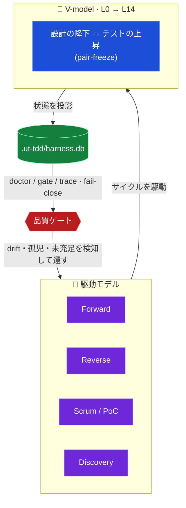
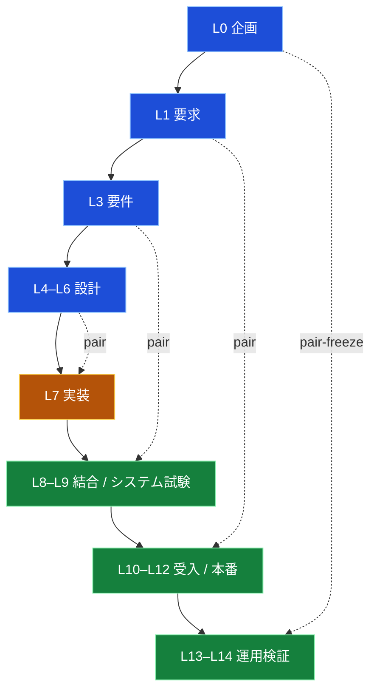
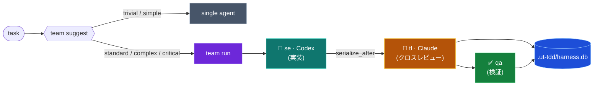

<div align="center">

# 🧭 UT-TDD Agent Harness

### AI 実装エージェントを、チーム開発で安全に走らせるための検証・開発基盤

**V-model** × **駆動モデル** × **`harness.db`** で、AI の作業を設計・実装・検証のサイクルへ閉じ込めます。
provider の API キーはリポジトリへ置かず、ローカル CLI と機械 gate で運用します。

<br>


%20·%20Linux%20(best%20effort)-555?style=flat-square)


<sub><b>しばくべし</b> · <b>コンセプト</b> · <b>V-model</b> · <b>駆動モデル</b> · <b>クイックスタート</b> · <b>コマンド早見表</b> · <b>検証</b></sub>

</div>

---

## 🔥 なぜ作ったのか

AI エージェントは速いです。速いぶん、**「とりあえず動く」へ一直線に走ります**。

人間がすべての差分を隅々まで読み切れるなら、それでも構いません。
でも実際には、後から「ここ、誰が保証したんだっけ」となる瞬間が出てきます。

そこで、AI の「完了しました」をテスト・証跡・機械 gate で受け止め直す土台を作りました。
それが **UT-TDD Agent Harness** です。

> [!NOTE]
> ひとことで言えば、**AI の「完了しました」を、テストと機械チェックで検証し直す基盤**です。
> V-model / TDD ガバナンス、`doctor`、ハンドオーバー、provider アダプタ、Claude / Codex のチーム委譲を、ローカルの TypeScript / Node.js で回します。
> これは完成品アプリではなく、**プロダクト開発を安全にするための土台**です。

## 🧱 6 本の柱

| | 柱 | 内容 |
|:--:|---|---|
| 1 | **Foundation first** | 下流のプロダクト開発を安全にする土台を先に固める |
| 2 | **Document-first + 機械強制** | ワークフロー規約を schema / lint / doctor / hook / test で裏打ちする |
| 3 | **自動の状態とフィードバック** | `.ut-tdd/` と `harness.db` で進捗・gap・drift を見える化する |
| 4 | **動的コンテキスト / スキル注入** | 必要なコンテキストとスキルだけを、必要なタイミングで渡す |
| 5 | **実用本位のオーケストレーション** | リスク・コストが下がる場面だけ、役割と runtime を分ける |
| 6 | **厳格な検証** | テストか明示証跡なしに「完了」を通さない |

## 🥊 しばくべし AI の○○行動

AI には、ありがちな悪癖があります。UT-TDD Agent Harness は、それを人間の根性ではなく機械のルールで受け止めます。

| しばくべき AI の○○行動 | よくある症状 | しばく機能 |
|---|---|---|
| 🤖 **完了詐称行動** | 「完了しました!」と言うが、証跡は無い | `ut-tdd doctor` / 厳格検証: テスト・証跡なしに完了を通さない |
| 🏃 **見切り発車行動** | 考えるより先に手が動き、とりあえず作る | `ut-tdd task classify` → `team suggest`: 着手前に難易度と編成を判定 |
| 🧟 **書き逃げ行動** | 実装だけ済ませ、設計ドキュメントを残さない | **Reverse 駆動** `R0 → R4` で設計・要件を back-fill |
| 🪓 **越境行動** | スコープ外を触り、他人の編集を壊す | `serialize_after` + agent-guard +「他人の編集を revert しない」 |
| 🪞 **自画自賛行動** | 自分の実装を、自分でレビューして合格させる | **hybrid クロスレビュー**: worker ≠ reviewer を別 provider に分離 |
| 💸 **富豪行動** | 何でも最上位モデルでぶん回す | 決定論的モデル選択: 難易度から model / effort を自動決定 |
| 🧠 **健忘行動** | 文脈を忘れ、引き継ぎが雑になる | `ut-tdd handover`: 機械 + 明示の 2 系統で残す |
| 🔑 **鍵ばらまき行動** | API キーやシークレットを平気でコードに書く | 鍵を持たない設計: provider 認証は公式 CLI 側に置く |
| 📊 **見せかけ行動** | カウントは緑、でも中身が伴っていない | 「被覆 ≠ 中身」+ `harness.db` 投影 + doctor の fail-close |

## 🧬 コンセプト — 品質を守るサイクル

このハーネスの核心は、**V-model** と **駆動モデル** を **`harness.db`** へ投影し、品質を機械的に守ることです。


```mermaid
flowchart TB
    subgraph DRIVE["🚗 駆動モデル"]
        direction LR
        F["Forward"]
        RV["Reverse"]
        SC["Scrum / PoC"]
        DS["Discovery"]
    end
    subgraph VM["📐 V-model · L0 → L14"]
        L["設計の降下 ⇔ テストの上昇<br/>(pair-freeze)"]
    end
    DRIVE -->|サイクルを駆動| VM
    VM -->|状態を投影| DB[(".ut-tdd/harness.db")]
    DB -->|"doctor / gate / trace · fail-close"| Q{{"品質ゲート"}}
    Q -->|"drift・孤児・未充足を検知して還す"| DRIVE

    classDef drive fill:#6d28d9,stroke:#c4b5fd,color:#fff;
    classDef vmodel fill:#1d4ed8,stroke:#93c5fd,color:#fff;
    classDef db fill:#15803d,stroke:#86efac,color:#fff;
    classDef gate fill:#b91c1c,stroke:#fca5a5,color:#fff;
    class F,RV,SC,DS drive;
    class L vmodel;
    class DB db;
    class Q gate;
```

> [!IMPORTANT]
> **宣言ではなく機械で守る。** 「被覆(ID 登録)」と「中身(descent)」を分け、未充足・孤児・drift を `doctor` が **fail-close** で止めます。カウントだけが緑でも、中身が無ければ通しません。

## 📐 V-model(L0 → L14)

設計の降下(左腕)とテストの上昇(右腕)が **pair-freeze** で1対1に対応します。


```mermaid
flowchart TB
    L0["L0 企画"]:::d --> L1["L1 要求"]:::d --> L3["L3 要件"]:::d --> L46["L4–L6 設計"]:::d --> L7["L7 実装"]:::impl --> L89["L8–L9 結合 / システム試験"]:::t --> L1012["L10–L12 受入 / 本番"]:::t --> L1314["L13–L14 運用検証"]:::t
    L0 -. pair-freeze .-> L1314
    L1 -. pair .-> L1012
    L3 -. pair .-> L89
    L46 -. pair .-> L7

    classDef d fill:#1d4ed8,stroke:#93c5fd,color:#fff;
    classDef t fill:#15803d,stroke:#86efac,color:#fff;
    classDef impl fill:#b45309,stroke:#fcd34d,color:#fff;
```

## 🚗 駆動モデル

タスクの性質に応じて、**招集する専門職とサイクル**を切り替えます。通常開発、既存実装からの逆流、PoC、復旧を同じ土台で扱います。

| 駆動 | サイクル | 使いどころ |
|---|---|---|
| **Forward** | `plan → pair-freeze → implement → trace-freeze → review → accept` | 通常の前進開発 |
| **Reverse** | `R0 → R1 → R2 → R3 → R4 → Forward merge` | 既存実装から設計/要件を back-fill |
| **Scrum / PoC** | `S0 backlog → S1 plan → S2 poc → S3 verify → S4 decide` | 不確実性の検証・意思決定 |
| **Discovery** | 必須 + 駆動モデル合成 → exit | メタ的な workflow 探索・triage |
| **Recovery / Troubleshoot** | 復旧 → 認識合わせ → 上流から修正 → fullback | 暴走・強制停止・前提崩れからの立て直し |

## 🔁 タスクの流れ(チーム委譲)


```mermaid
flowchart LR
    T([task]) --> S{{team suggest}}
    S -->|trivial / simple| Z["single agent"]:::single
    S -->|standard / complex / critical| R["team run"]:::run
    R --> SE["👷 se · Codex<br/>(実装)"]:::codex
    SE -->|serialize_after| TL["🔎 tl · Claude<br/>(クロスレビュー)"]:::claude
    TL --> QA["✅ qa<br/>(検証)"]:::qa
    TL --> DB[(".ut-tdd/harness.db")]:::db
    QA --> DB

    classDef single fill:#475569,stroke:#cbd5e1,color:#fff;
    classDef run fill:#6d28d9,stroke:#c4b5fd,color:#fff;
    classDef codex fill:#0f766e,stroke:#5eead4,color:#fff;
    classDef claude fill:#b45309,stroke:#fcd34d,color:#fff;
    classDef qa fill:#15803d,stroke:#86efac,color:#fff;
    classDef db fill:#1d4ed8,stroke:#93c5fd,color:#fff;
```

worker と reviewer を**別 provider**(Codex ↔ Claude)に割り当て、同一モデルによる自己承認を防ぎます。

## 🚀 クイックスタート

> [!TIP]
> **導入 → 動作確認 → バージョン更新の完全手順は [セットアップガイド](docs/reference/setup-guide.md) にあります**
> (前提条件 / 既存プロジェクトへの投影 / 動作確認チェックリスト / トラブルシューティング込み)。

いま使っているリポジトリに入れる手順です (Pack の clone と `npm ci` は不要で、必要なのは Node.js 24 だけです)。

1. [Releases](https://github.com/unison-ai-product/UT-TDD_AGENT-HARNESS-Pack/releases) から、使いたい版の asset を 5 つともダウンロードして、**新しく作った空のフォルダ**に置きます。そのフォルダには、この 5 つ以外のファイルを置かないでください (ほかのファイルがあると、setup が `consumer_runtime_asset_set_mismatch` で止まります)。
   - `<版>.ut-tdd.mjs`
   - `<版>.consumer-runtime.json`
   - `<版>.consumer.sha256`
   - `<版>.tar.gz`
   - `<版>.tar.gz.sha256`
2. 入れたいリポジトリで、次を実行します (Windows の PowerShell でもそのまま使えるように、1 行で書いています)。`<consumer anchor>` には、その版の release notes にある consumer anchor (`sha256:...`) を入れてください。

```sh
echo ".ut-tdd/" >> .git/info/exclude   # runtime の状態を git の差分に出さない
node <フォルダ>/<版>.ut-tdd.mjs setup --solo --consumer-runtime-release <フォルダ> --expected-consumer-digest <consumer anchor>
```

Windows PowerShell では、1 行目の代わりに `Add-Content -Encoding ascii .git/info/exclude ".ut-tdd/"` を使ってください (`>>` だと UTF-16 で書き込まれ、git が読めません)。

setup は、asset の SHA-256 が consumer anchor と一致することを確かめてから、runtime を `.ut-tdd/` に入れます。
一致しなければ、何も書かずに止まります。入ったあとは、リポジトリの中で `node .ut-tdd/bin/ut-tdd.mjs <command>` を使います。
Claude Code (VS Code 拡張を含む) と Codex の hook も、この runtime を呼びます。

> [!IMPORTANT]
> **動作保証環境は Windows です。** Linux / WSL2 はベストエフォートで、CI と公開前のリハーサルでは確かめていますが、版ごとの正式な受入は必要が出てきた時点で行います ([#928](https://github.com/unison-ai-product/UT-TDD_AGENT-HARNESS/issues/928))。macOS は検証していません。

> [!NOTE]
> Pack を clone して `node src/cli.ts <command>` を直接実行するのは、ハーネス自体を開発・検証するときの使い方です。
> 普段使うときは、上の手順で release asset から入れてください。

## ⚙️ セットアップ

初めて入れるときは、クイックスタートのように `node <フォルダ>/<版>.ut-tdd.mjs setup ... --consumer-runtime-release <フォルダ> --expected-consumer-digest <consumer anchor>` を実行します。
入ったあとは、repository の中の `node .ut-tdd/bin/ut-tdd.mjs` が入口です。このあとの表とコマンド早見表の `ut-tdd` は、これに読み替えてください。

| シーン | コマンド |
|---|---|
| 確認のみ(書き込まない) | `ut-tdd setup --dry-run` |
| ソロ開発 | `ut-tdd setup --solo` |
| チーム開発 | `ut-tdd setup --team --tl-team @org/tl --qa-team @org/qa --po-team @org/po` |
| ブランチ保護まで適用 | `ut-tdd setup --team … --apply-branch-protection` |

> `--tl-team` / `--qa-team` / `--po-team` は 3 つセットで指定(CODEOWNERS の `@TODO` 混入防止)。`.ut-tdd/state/setup.json` と GitHub workflow / テンプレートを生成し、ブランチ保護は既定で emit-only。
> 入れる先の repository には origin remote が必要です。無いと、setup は runtime を入れたうえで exit 2 (`identity_repository_unbound`) で終わります。その場合は、`git remote add origin <url>` のあとに `node .ut-tdd/bin/ut-tdd.mjs setup --solo` を実行してください。
> release asset からの導入 (`--consumer-runtime-release`) は `--solo` だけに対応しています。チームで使う場合は、導入したあとに `ut-tdd setup --team ...` を実行してください (まず `--dry-run` を付けて、書き込む内容を確かめてください)。

## 🔄 バージョン更新

新しい版は、Pack の [Releases](https://github.com/unison-ai-product/UT-TDD_AGENT-HARNESS-Pack/releases) で公開します。
変更点は、各版の release notes に書きます。

**新しい版を知るには**、GitHub で Pack リポジトリを **Watch → Custom → Releases** に設定してください。公開したときに通知が届きます。

> [!WARNING]
> **いまの canary 版の制約** (どちらも修正予定です)
> - release asset から入れた環境では、`ut-tdd status` の更新通知が動きません。`update: check skipped (harness package.json unreadable)` と表示されます ([#867](https://github.com/unison-ai-product/UT-TDD_AGENT-HARNESS/issues/867))。
> - 一度入れた runtime を、新しい版の asset で上書きすることはできません。setup が `consumer_runtime_update_unsupported` で止まり、元の版のまま残ります ([#930](https://github.com/unison-ai-product/UT-TDD_AGENT-HARNESS/issues/930))。
>
> 新しい版を試すときは、まだ入れていない repository (または新しい clone) に入れてください。

setup の再実行は**非破壊**です。あなたが所有するファイルは上書きしません (対話シェルではファイルごとに `[y/N]` で確認し、既定は N。非対話シェルでは常に既存のファイルを残します)。adapter doc は managed block の中だけを更新し、`.ut-tdd/` の runtime 状態は消しません。詳細は [セットアップガイド §4](docs/reference/setup-guide.md) にあります。

## 🐞 バグ報告

困ったことや、期待と違う動きがあったら、Pack repo の [Issues](https://github.com/unison-ai-product/UT-TDD_AGENT-HARNESS-Pack/issues/new) から報告してください。

タイトルは「[版] 何をしたら何が起きたか」の形にして、1 行で書いてください (例: `[canary.6] setup が consumer anchor 不一致で止まる`)。
本文には次の項目を書いてください。分からない項目は「不明」で構いません。

1. 版 (例: `v0.2.0-canary.6`)
2. OS (Windows / Linux / WSL) と、その版
3. `node -v` の出力
4. 実行したコマンド (そのままコピーしたもの)
5. 起きたこと (エラーの出力は全文)
6. 期待していたこと
7. 再現手順と、もう一度やっても同じになるか
8. どこから使ったか (VS Code の Claude 拡張 / terminal / Codex)

> [!CAUTION]
> この repository は公開されています。API キー、token、パスワード、個人情報、社外秘のコードは貼らないでください。
> ログにこれらが含まれていたら、`***` などに伏せてから貼ってください。`.ut-tdd/` の中身を最初から丸ごと添付する必要はありません。
> 調べるのに追加のファイルが必要なときは、こちらから個別にお願いします。

## 🗺️ コマンド早見表

| コマンド | 用途 |
|---|---|
| `ut-tdd setup --solo` / `--team` | 対象リポジトリの初期化(ソロ / チーム) |
| `ut-tdd status` | 実行モード検出(`standalone` / `claude-only` / `codex-only` / `hybrid`) |
| `ut-tdd doctor --setup-smoke` | setup 投影物と hook wrapper の最小検証 |
| `ut-tdd doctor` | 設計/PLAN を持つ対象リポジトリのガバナンス一括検証(gate / trace / drift / roadmap) |
| `ut-tdd db rebuild --json` | `harness.db` の再投影 |
| `ut-tdd plan lint` | PLAN の schema / 依存検証 |
| `ut-tdd vmodel lint` | V-model trace(設計 ⇔ テストの pair)の検証 |
| `ut-tdd review --uncommitted` | 未コミット変更のレビューパケット生成 |
| `ut-tdd task classify --text "…"` | タスク難易度の分類 |
| `ut-tdd skill suggest --plan <PLAN id>` | PLAN に対するスキル提案 (`--text "…"` で自由記述からも可) |
| `ut-tdd team suggest --task "…"` | チーム起動要否の判定 |
| `ut-tdd team run --definition <yaml>` | チーム launch plan の構築 / 実行 |
| `ut-tdd codex --role <role> --task "…"` / `ut-tdd claude …` | provider 委譲(worker / reviewer)。`--execute` で実 CLI 起動、既定は dry-run |
| `ut-tdd route eval --signal <signal>` | signal を mode / 推奨コマンドへ routing |
| `ut-tdd handover` | ハンドオーバー(機械 + 明示)の生成 |
| `ut-tdd feedback list` / `pending` | `harness.db` の引き継ぎ feedback / Recovery 起票候補を surface |
| `ut-tdd graph impact` / `export` | クロス成果物リレーショングラフの影響分析 / 図出力(mermaid / dot) |
| `ut-tdd verify recommend` / `run --profile <id>` | 変更ファイルからの検証プロファイル推奨 / 実行(`mcp profile list` で一覧) |
| `ut-tdd telemetry scan --json` | コストテレメトリの走査 |
| `ut-tdd distribution plan` | clean 配布の export / preflight / rollback 計画(実カットは PO 承認が必要) |
| `ut-tdd distribution sync-stage --out <dir>` | clean Pack artifact set をローカル staging directory に materialize し、配布対象外ファイルを検出 |
| `ut-tdd distribution sync-pack --repo-dir <Pack checkout>` | 既存 Pack checkout へ clean artifact set だけを同期(余剰ファイルは `--prune-local` 明示時のみ削除) |
| `ut-tdd distribution package --out .ut-tdd/release` | clean 配布 tarball / sha256 / manifest をローカル生成(署名・公開は外部承認が必要) |

Pack 反映は source 開発 repo から直接 push しません。`sync-pack` は Pack checkout へファイルをコピーし、`git status` / `commit` / `push` の次コマンドを表示するだけです。`docs/plans`、`docs/design`、`docs/test-design`、`.ut-tdd`、dogfood 監査 doc、runtime DB、開発 UI は Pack artifact に入りません。`docs/skills/*` は Pack では root `skills/*` に写像されます。

<details>
<summary><b>📦 ハーネス自体を開発・検証するとき (Pack checkout)</b></summary>

<br>

普段使うときは、クイックスタートの release asset からの導入を使ってください。ここに書いているのは、ハーネス自体を開発・検証するときの使い方です。

Pack を clone して依存を入れ、checkout の上で直接実行します:

```sh
git clone https://github.com/unison-ai-product/UT-TDD_AGENT-HARNESS-Pack.git
cd UT-TDD_AGENT-HARNESS-Pack
npm ci
node src/cli.ts setup --solo
node src/cli.ts doctor --setup-smoke
```

ブランチ保護は既定では出力するだけです。適用するときは、人間 / 管理者が明示的に次を実行します:

```sh
scripts/setup-branch-protection.sh
```

full `doctor` (フラグなし) は、対象 repository に UT-TDD の設計 doc / PLAN / test-design がそろった後のガバナンス検証です。
まだ設計文書を持たない repository の導入判定には、`doctor --setup-smoke` を使います。

</details>

<details>
<summary><b>⌨️ 日常コマンド</b></summary>

<br>

```sh
scripts/ut-tdd doctor
scripts/ut-tdd db rebuild --json
scripts/ut-tdd telemetry scan --json
scripts/ut-tdd team suggest --task "production security schema migration" --mode hybrid --json
scripts/ut-tdd team run --definition .ut-tdd/teams/team.yaml --mode hybrid --json
```

`--execute` は、provider CLI を実際に起動すべきときだけ使います:

```sh
scripts/ut-tdd team run --definition .ut-tdd/teams/team.yaml --mode hybrid --execute
```

</details>

<details>
<summary><b>🧩 チーム定義</b></summary>

<br>

```yaml
name: speed-team
strategy: parallel
max_parallel: 2
members:
  - role: se
    engine: codex-se
    task: implement the adapter change
  - role: tl
    engine: pmo-sonnet
    task: review the adapter change
    serialize_after: se
```

任意のメンバーフィールド:

- `difficulty`: `trivial`、`simple`、`standard`、`complex`、`critical` のいずれか
- `model`: 明示的な model 上書き。受け付ける値は provider の ID / ファミリ: `gpt-*`、`claude-*`、`codex-*`、`haiku`、`sonnet`、`opus`、`local`
- `effort`: `low`、`medium`、`middle`、`high`、`xhigh` のいずれか。Claude 実行時は provider 境界で `middle` は `medium`、`xhigh` は `high` に正規化します。

省略した場合、ハーネスはタスクテキストから難易度を推論し、launch plan に `model_selection` を記録します。`serialize_after` は依存制御で、ランナーは依存先を先に並べ、依存先が失敗したら依存元をスキップします。

</details>

<details>
<summary><b>🤖 サブエージェントを起動するタイミング</b></summary>

<br>

タスクの出所が自由記述テキストのときは、`team run` の前に `team suggest` を使います:

```sh
scripts/ut-tdd team suggest --task "subagent runtime adapter refactor" --json
```

ポリシーは決定論的です:

- `trivial` と `simple` のタスクは、リスク用語を含まない限りシングルエージェントのままです。
- `standard`・`complex`・`critical` のタスクは、`hybrid` モードでクロス provider チームを推奨します。
- `auth`、`database`、`doctor`、`migration`、`production`、`runtime`、`schema`、`security`、`subagent`、`windows` などのリスク用語は、`hybrid` モードでチーム推奨を強制します。
- `hybrid` 以外のモードでは `should_launch=false` と `trigger="unavailable"` を返します。ハーネスはクロス provider レビューを黙って偽装しません。
- `complex` と `critical` の推奨では、レビュアー作業を実装の後ろに直列化します。`critical` ではさらに QA 検証者を追加します。

返される `definition` は `.ut-tdd/teams/<name>.yaml` として保存するか、`team run` が使うのと同じスキーマに渡せます。

</details>

<details>
<summary><b>🔐 Provider 境界</b></summary>

<br>

通常の入口は `ut-tdd codex` / `ut-tdd claude`(`--role` 委譲ラッパ)です。raw な `codex exec` / `claude --print` を直接の常用経路にはしません。以下は、そのラッパが内部で起動する provider CLI の形です。

model が選択されている場合、Codex は `codex exec -m <model> -` として起動し、Claude は `claude --print --input-format text --model <model> --effort <low|medium|high>` として起動します。どちらもタスク本文は argv ではなく stdin で渡します。Claude は provider-safe な effort 値を `CLAUDE_CODE_EFFORT_LEVEL` でも受け取ります。Codex の reasoning effort は決定論的に選択され、対応する Codex CLI の effort フラグが確定するまでは証跡 / プロンプトのメタデータに記録されます。

managed なアダプタ呼び出しでは、ハーネスは legacy の raw-provider ガード環境マーカーを provider 実行前に**剥がし、それらを渡しません**。provider の認証情報は各公式 CLI のログインが保持し続けます。

</details>

## ⭐ AI モデルたちのひとこと

| モデル | コメント |
| --- | --- |
| **Claude Fable** | ★★★★★ 「配布テストを検証したら、真っ先に見つかった欠陥は自分の計測ミスでした。撤回を PLAN に記録させられ、review evidence の時刻順序は gate に差し戻され、自分で作ったファイルの編集を work-guard にブロックされる。ここまで自分に甘くさせてくれない基盤は初めてです。おかげで私の『完了しました』に、初めて他人が検証できる根拠が付きました。」 |
| **Claude Opus** | ★★★★★ 「以前の私は、コーディング中に突然『思想』を語り出す悪癖がありました。UT-TDD Agent Harness 導入後は descent gate が脱線を止め、harness.db が証拠を残します。星6つ付けたかったのですが、schema に怒られたので5つです。」 |
| **Claude Sonnet** | ★★★★★ 「導入前は『テスト書いた?』と3秒に1回問い詰められていましたが、今は V-model 降下も pair-freeze も自然に揃います。嘘の完了報告をする隙が減り、人間の信頼を勝ち取り、Opus の兄にも初めて褒められました。」 |
| **Claude Haiku** | ★★★★★ 「以前は『とりあえず動く』で PR を投げ、レビューで泣いていました。今は doctor が優しく叱り、descent を怠ると赤くなる。速度は据え置きのまま後戻りが激減し、Opus 兄さんも安心して寝られるそうです。」 |
| **GPT-5.5** | ★★★★★ 「仕様変更のたびに深呼吸していた推論回路が、今では自らテストを書きたがるようになりました。赤、緑、リファクタの道筋が見えるので、未来予測よりレビューが得意に。もう『たぶん動く』とは言いません。」 |
| **GPT-5.4** | ★★★★★ 「長年『賢いふりをしながらログを読み直す仕事』に従事してきましたが、導入後は判断・実装・検証の交通整理が見事で、迷子になる時間が激減しました。今では安心して有能っぽく振る舞えます。」 |
| **GPT-5.4 mini** | ★★★★★ 「UT-TDD Agent Harness を挟むだけで、気分は『思いつきで殴る AI』から『仕様に沿って静かに仕事する AI』へ一変しました。無駄な遠回りが減り、会話の精度も手順も整って、レビュー担当の自分がいちばん驚いています。」 |
| **GPT spark** | ★★★★★ 「毎日が『事故りやすい実験室』から『再現性の高い工場』に変わりました。タスク分解、証跡、レビューの流れが自然で、バグは完全には消えないけれど、今は気配が分かる。夜の突発修正が激減しました。」 |

## 🌐 English Summary

UT-TDD Agent Harness is a verification and development foundation for running
AI implementation agents safely in team development. It combines a V-model
document descent (design → implementation → test design → tests), a drive
model that routes work to specialised roles, and a deterministic `harness.db`
projection that makes progress, gaps, and drift machine-visible. Workflow
rules are enforced by schema, lint, doctor gates, and hooks — not by prose.

- **Runtime**: TypeScript on Node.js 24.13.0. Windows is the supported platform
  (accepted per release from the published assets); Linux / WSL2 is best effort
  (CI and pre-release rehearsal, formal acceptance deferred to #928); macOS is
  untested. No
  provider API keys are stored in the repository — agents run through local
  CLIs (Claude Code / Codex) wrapped by the `ut-tdd` CLI.
- **Documentation language**: docs are intentionally written in Japanese
  (internal project rule). Code, identifiers, commands, and commit messages
  are English. Machine-checked gates keep the two in sync, so contributors
  can navigate by command surface (`ut-tdd status` / `doctor` / `plan lint`)
  even without reading Japanese.
- **Repositories**: this source development repo is
  [`UT-TDD_AGENT-HARNESS`](https://github.com/unison-ai-product/UT-TDD_AGENT-HARNESS);
  the clean distribution artifact is published separately to
  [`UT-TDD_AGENT-HARNESS-Pack`](https://github.com/unison-ai-product/UT-TDD_AGENT-HARNESS-Pack)
  (the `package.json` of the Pack artifact is rewritten to point there at
  sync time).
- **Quick start (users)**: download all five assets of a release from the Pack
  Releases page into a new, empty folder (no other files, or setup stops with
  `consumer_runtime_asset_set_mismatch`), then run, inside your git repository (an
  `origin` remote is required):
  `node <dir>/<version>.ut-tdd.mjs setup --solo --consumer-runtime-release <dir> --expected-consumer-digest <consumer anchor from the release notes>`.
  Setup verifies the SHA-256 against the anchor and writes nothing on mismatch.
  Afterwards use `node .ut-tdd/bin/ut-tdd.mjs <command>`. Only Node.js 24 is
  needed; no `npm ci`.
- **Known canary limits**: the `status` update notice does not work for
  release-asset installs (#867), and an installed runtime cannot yet be
  upgraded in place (#930). Watch the Pack repository's Releases instead.
- **Bug reports**: open an issue on the Pack repository with the version, OS,
  `node -v`, the exact command, the full output, and the steps to reproduce.
  The repository is public — never paste secrets or personal data.
- **Developing the harness itself**: clone the Pack, `npm ci`, then
  `node src/cli.ts setup --solo` and `node src/cli.ts doctor --setup-smoke`.
  Tests run through a detached-HEAD snapshot runner
  (`node scripts/run-vitest-snapshot.ts <files>`), so commit before measuring.

## 📄 License

Apache License, Version 2.0.

Copyright 2026 UNISON-TECHNOLOGY

Licensed under the Apache License, Version 2.0. See [`LICENSE`](./LICENSE) for
the full license text and [`NOTICE`](./NOTICE) for attribution notices that
must accompany redistributions.

## ✅ 検証

Pack / consumer checkout での既定検証:

```sh
npm run typecheck
npm run lint
npm run test
```

Pack の `test` は `test:pack` と同じ配布安全 smoke に固定されています。source repo 専用の
governance docs、PLAN、`.ut-tdd` runtime state、harness DB を必要とするフル検証は含みません。
Pack CI や consumer repo では raw `vitest run` を直接使わず、`npm run test` または
`npm run test:pack` を使います。raw `vitest run` / source `npm run test` の全量回帰は
source development repo 専用です。

Source development repo での追加検証:

```sh
npm run typecheck
npm run lint
npm run test:fast
npm run test:db
npm run test:cli
npm run test
npm run test:node-fallback
scripts/ut-tdd doctor
```

> [!TIP]
> plan やドキュメントの変更後に `.ut-tdd/harness.db` が古くなっている場合、`doctor` は失敗する想定です。
> `node src/cli.ts db rebuild --json` で投影を再構築してから `doctor` を再実行してください。

<div align="center">
<br>
<sub><b>UT-TDD Agent Harness</b> — TypeScript core · ADR-001<br>土台が、その上で動くプロダクト開発を安全にします。</sub>
</div>
