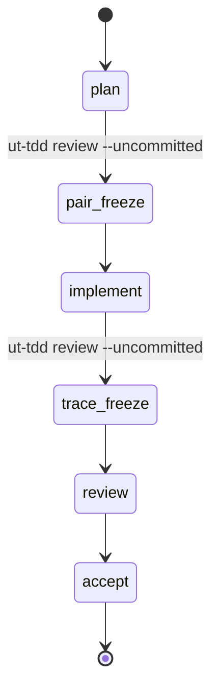
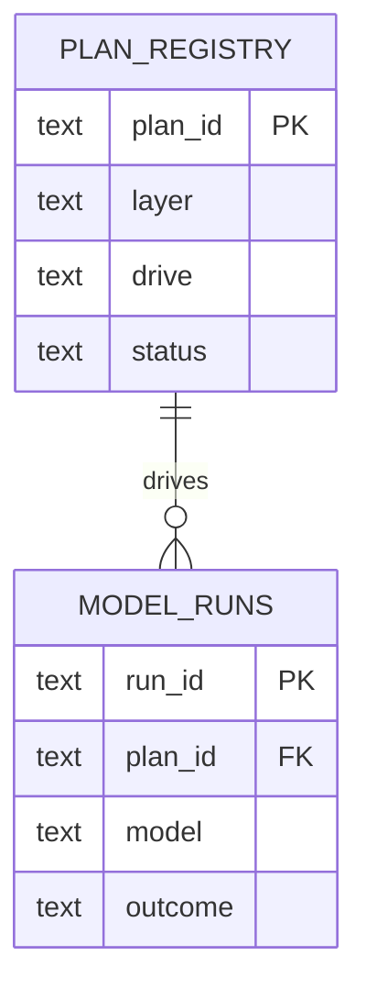

# design doc

When and how to produce Mermaid / D2 diagrams as part of UT-TDD design docs.
Diagrams are versioned design artifacts, not illustrations, and pass the same
freeze readability check as prose.

## When to load this skill

- Authoring a `docs/design/` doc at L2–L5 that describes component structure,
  data flow, API sequence, or state transitions.
- Writing an ADR whose decision involves a system boundary or data model.
- A Reverse R2 pass capturing as-is architecture.

## Mermaid vs D2

Default to inline Mermaid for V-model layer docs. Promote to a D2 source file
(`docs/diagrams/`) only when layout control is needed or the diagram is
referenced from more than one doc (single source of truth). Commit D2 source
alongside any generated SVG — never commit only the SVG.

## Diagram obligation by layer

- **L2 (screen/IA):** a screen-flow or component-hierarchy `flowchart`.
- **L3 (functional):** a state-transition diagram per stateful feature; a
  sequence diagram per API surface.
- **L4 (basic):** a module component diagram; an ER diagram for DB changes.
- **L5 (detailed):** optional, when a class/data boundary is non-obvious.

## Mermaid templates (UT-TDD contexts)

PLAN lifecycle state:

harness.db projection (ER):

## Freeze diagram checklist

- [ ] Every diagram has a one-sentence caption stating what it shows.
- [ ] Mermaid compiles without error (preview locally).
- [ ] Node labels match the L0 glossary and the prose terminology in the doc.
- [ ] D2 source is committed alongside the referencing doc.
- [ ] No diagram is the sole location of a decision — prose states the decision;
      the diagram illustrates it.
- [ ] Reverse R2 diagrams are labeled "as-is" and dated.

Run `ut-tdd review --uncommitted` after adding diagrams; a layer that mandates a
diagram cannot reach pair-freeze with a "TODO: add diagram" placeholder.
